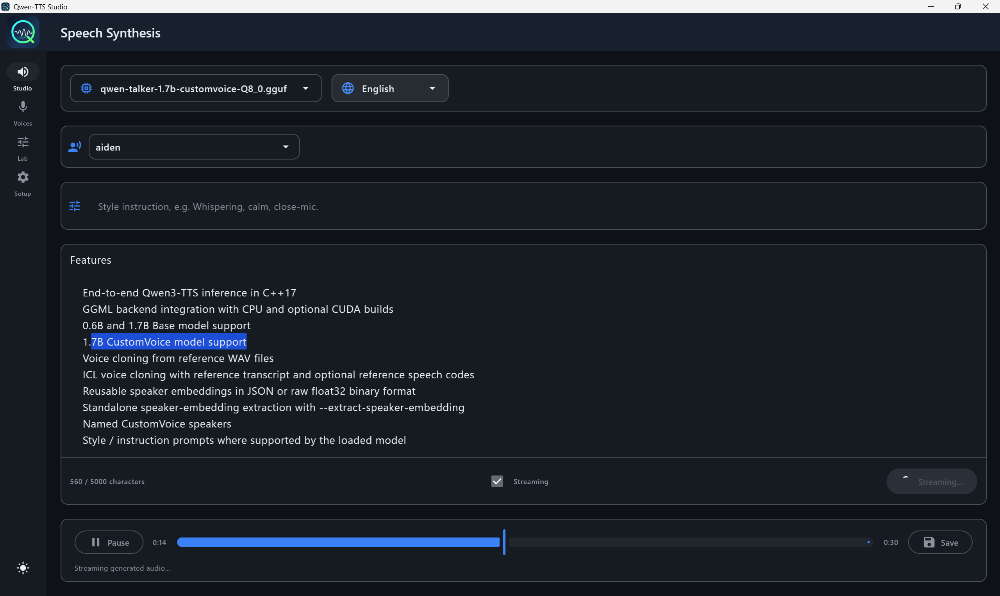

# Qwen-TTS Studio

Qwen-TTS Studio is a modern desktop application for high-quality, local text-to-speech generation. It leverages a high-performance C++ backend (`qwen3-tts.cpp`) to provide fast inference without the need for Python or a cloud connection.



## Features

- **Local Inference:** All processing happens on your machine. No data leaves your computer.
- **High Performance:** Powered by a native C++ engine with support for CPU and NVIDIA CUDA acceleration.
- **Voice Cloning:** Create custom voice presets from a short reference audio clip (supported by Base models).
- **Styled Speech:** Use natural language instructions to control the tone, emotion, and style of the generated speech (supported by CustomVoice models).
- **Named Speakers:** Built-in support for models with predefined speaker profiles.
- **Adaptive UI:** The interface automatically adapts to the capabilities of the loaded model.
- **Cross-Platform:** Built with Compose Multiplatform, supporting Windows and Linux.

## Quick Start

### 1. Prerequisites
- **Windows:** Visual Studio 2022 Build Tools, CMake, and a Java 21+ JDK.
- **Linux:** GCC/Clang, CMake, and a Java 21+ JDK.
- **NVIDIA GPU (Optional):** CUDA Toolkit for hardware acceleration.

### 2. Installation

```bash
# Clone the repository with submodules
git clone --recursive https://github.com/Danmoreng/qwen-tts-studio.git
cd qwen-tts-studio

# Build the native backend (Windows)
pwsh -ExecutionPolicy Bypass -File .\scripts\build-native.ps1

# Build the native backend (Linux)
chmod +x scripts/build-native.sh
./scripts/build-native.sh

# Run the application
# Windows:
.\gradlew.bat :composeApp:run
# Linux:
./gradlew :composeApp:run
```

For detailed build instructions, including CUDA support and packaging, see [docs/BUILD.md](docs/BUILD.md).

### 3. Model Setup

Qwen-TTS Studio requires GGUF model files to operate.

1.  **Download Models:** You can find compatible models on Hugging Face (e.g., [Qwen3-TTS](https://huggingface.co/Qwen/Qwen3-TTS-12Hz-0.6B-Base)).
2.  **Prepare Models:** Use the tools in `external/qwen3-tts-cpp/scripts` to convert models to GGUF format if they aren't already.
3.  **Configure App:**
    - Open Qwen-TTS Studio and go to the **Setup** tab.
    - Set your **Model Directory**.
    - Select your **Model File** from the list.

## Usage Guide

### Studio
The main generation interface.
- **Text:** Enter the text you want to synthesize.
- **Speaker:** Select a named speaker or a custom voice preset.
- **Instruction:** (If supported) Enter style instructions like "Whispering" or "Excited".
- **Generate:** Click to synthesize and play the audio.

### Voices
Manage your voice presets.
- **Extract:** Upload a short WAV file (3-10 seconds) to extract a voice embedding.
- **Save:** Give your custom voice a name to use it in the Studio tab.

### Setup
Configure application settings and models.
- **Model Path:** The folder where your GGUF models are stored.
- **Backend:** Monitor and configure backend settings (CPU/CUDA).

## Documentation

- [Build Guide](docs/BUILD.md) - Detailed compilation and packaging instructions.
- [Development Plan](docs/DEVELOPMENT_PLAN.md) - Project roadmap and implementation details.
- [Native Backend](external/qwen3-tts-cpp/README.md) - Technical details about the C++ engine.

## License

This project is licensed under the MIT License - see the [LICENSE](LICENSE) file for details.
